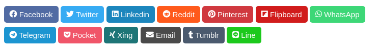
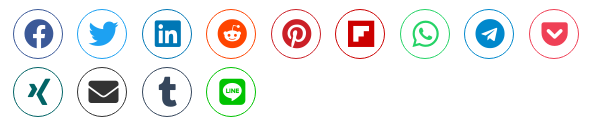

# Sharer Plugin

**Sharer** is a plugin for [Grav](http://github.com/getgrav/grav) that lets you add social buttons to your templates. Simple, customizable and extensible. Based on [Sharer.js](https://ellisonleao.github.io/sharer.js/) a lightweight JS library with no dependencies.




## Installation

Installing the Sharer-plugin can be done in one of two ways. The GPM (Grav Package Manager) installation method enables you to quickly and easily install the plugin with a simple terminal command, while the manual method enables you to do so via a zip file.

### GPM Installation (Preferred)

The simplest way to install this plugin is via the [Grav Package Manager (GPM)](http://learn.getgrav.org/advanced/grav-gpm) through your system's terminal. From the root of your Grav folder type:

    bin/gpm install sharer

This will install the plugin into your `/user/plugins` directory within Grav. Its files can be found under `/your/site/grav/user/plugins/sharer`.

### Manual Installation

To install this plugin, just download the zip version of this repository and unzip it under `/your/site/grav/user/plugins`. Then, rename the folder to `sharer`. You can find these files on [GitHub](https://github.com/ayozehd/sharer) or via [GetGrav.org](http://getgrav.org/downloads/plugins#extras).

You should now have all the plugin files under

    /your/site/grav/user/plugins/sharer


## Usage

Include this line in any template file similar to `item.html.twig`:
```

```

Or you can use a Twig function:
```
{{ sharer() }}
```

### Page hierarchy

Sharer plugin merge defined plugin configuration and page header frontmatter parameters. That means you can change links or behaviour defined and customize the rendering of plugin on every page.

_user/pages/blog/item.md_
```
title: My Page
sharer:
    enabled: true|false
    buttons:
        email:
            to: non-default@email.com
...
```

By default Sharer plugin get current page URL, but you can set a custom one following Page hierarchy as above.

```
sharer:
    url: https://domain.org/example
```

### Settings

| Variable | Default | Options | Note |
|----------|---------|-------------------------------------------------|--------------------------------------------------------------------------------------------|
| enabled | true | `true` or `false` | Enables or disables the plugin. |
| built_in_css | true | `true` or `false` | Disable plugin CSS. |
| fontawesome_icons | true | `true` or `false` | Switch between FontAwesome icons or SVG images |
| fontawesome_v4 | false | `true` or `false` | It's possible to use FontAwesome v4 icons. Enable if your theme still uses it |
| fontawesome_css | true | `true` or `false` | Disable if your theme already has FontAwesome support, probably you don't want to duplicate CSS files. |
| template | rounded | `rounded` or `circles` | Choose a template to render buttons |
| buttons: |  |  |  |
|   enabled | true | `true` or `false` | Enable or disable this button |
|   label | Name | `string` | Customize the label of button |
|   icon | FontAwesome Icon | `string` | Customize the FontAwesome icon |
|   icon_group | FontAwesome Icon Group | `fas`, `far` or `fab` | FontAwesome Icon Groups: Solid, Regular or Brand |
|   priority | `0-12` | `number` | Position of buttons |
|   More params | * | * | Some buttons support more parameters like `to` or `hashtags` from [Share.js](https://ellisonleao.github.io/sharer.js/). Check out all available options!

## Extending

Use a SCSS-compiler, like LibSass, and compile scss/sharer.scss to your assets in the plugin-folder. For example: `sass --watch --source-map true assets/scss/sharer.scss assets/scss/sharer.css`.

## License

See [LICENSE](LICENSE)